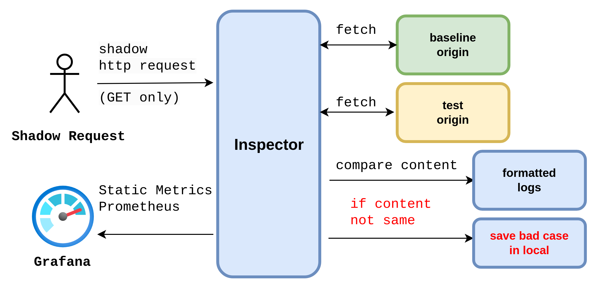
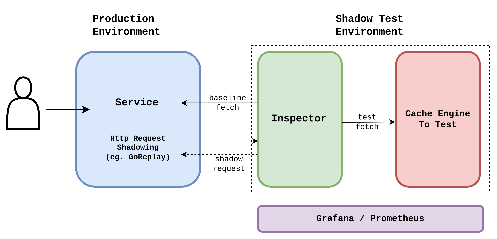

# inspector

🕵️ **inspector** is a simple tool to compare HTTP Content between 2 origin.

It's originally designed for our web cache proxy [**hitori**](http://github.com/bocchi-the-cache/hitori).

Feel free to use it for other purposes.

## Structure


## Usage

### Get and Compile

```bash
git clone https://github.com/bocchi-the-cache/inspector.git
cd inspector
make build
```
Binary file and default config file will be generated in `dist/inspector-VERSION/inspector`

### Config
A default config file in `dist/inspector-VERSION/config/config.yaml`

```yaml
http:
  listen_port: 4399

host:
  baseline:
    "127.0.0.1:9090"
  test:
    "127.0.0.1:8080"

storage:
  base_case_path:
    "bad_case"
```

Change `baseline` and `test` address to your own server address.
If http content is different, the content will be saved in `bad_case` directory.

### Run

```bash
./dist/inspector-VERSION/inspector
```

### Check
There several check status between baseline and test http content.
The checking order is also same as below.
- `FETCH_ERROR`: either `baseline` or `test` can't be fetched.
- `STATUS_NOT_MATCH`: http status code is different.
- `EMPTY_CONTENT`: either `baseline` or `test` http body is empty.
- `STATUS_NOT_200/206_SKIP`: http status code is same, but not 200/206.
- `CONTENT_NOT_MATCH`: http body is different.
- `PASS`: http body is same.


### Logs
`log/log.txt` logs inspector's running status.

`log/result.txt` logs the result of compare.

Bad body content will be saved in `bad_case` directory.

### Monitoring
Metrics are exposed on `/metrics` endpoint.
You can use Prometheus/Grafana to monitor inspector and results.
```go
var (
	RequestReceiveTotalCounter = prometheus.NewCounterVec(prometheus.CounterOpts{
		Name: "bocchi_inspector_request_receive_total",
		Help: "total number of requests received",
	}, []string{"node", "method", "host"})

	RequestSendTotalCounter = prometheus.NewCounterVec(prometheus.CounterOpts{
		Name: "bocchi_inspector_request_send_total",
		Help: "total number of requests sent",
	}, []string{"node", "method", "host", "dst", "status"})

	ResultTotalCounter = prometheus.NewCounterVec(prometheus.CounterOpts{
		Name: "bocchi_inspector_result_total",
		Help: "result of http content checking",
	}, []string{"node", "method", "status"})

	ErrorTotalCounter = prometheus.NewCounterVec(prometheus.CounterOpts{
		Name: "bocchi_inspector_error_total",
		Help: "error of inspector",
	}, []string{"node", "method", "process", "error"})

	ElapsedMonitor = prometheus.NewHistogramVec(prometheus.HistogramOpts{
		Name:    "RequestTimeConsumingStatistics",
		Help:    "api request elapsed time histogram",
		Buckets: []float64{0.1, 0.5, 1, 5, 10, 20, 50, 100, 500, 1000, 5000},
	}, []string{"node", "process"})
)
```

## Practice
A possible practice is to use `inspector` to monitor web cache.

